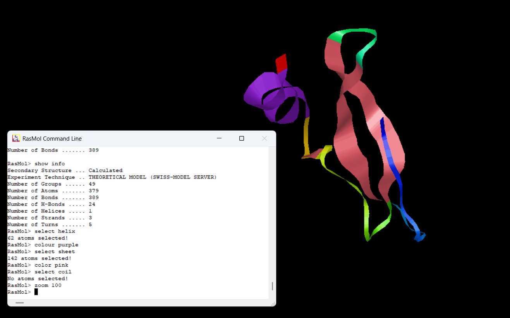
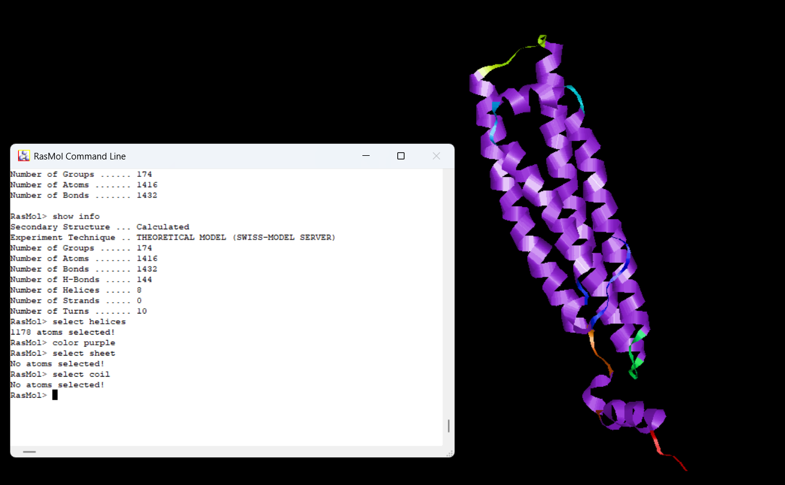
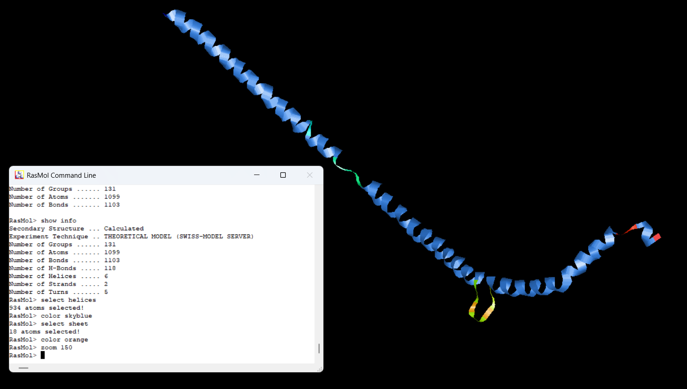
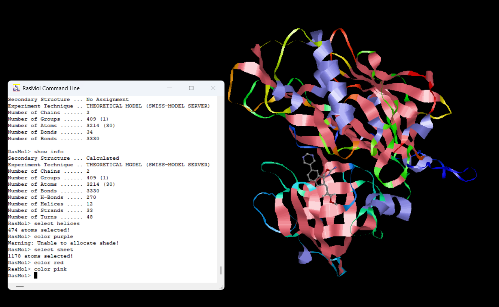
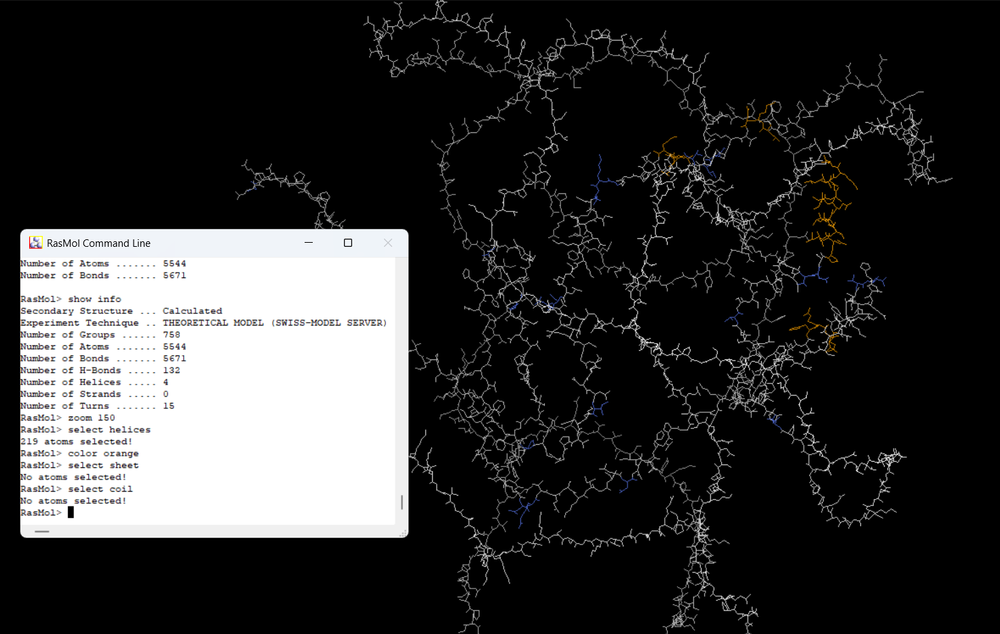
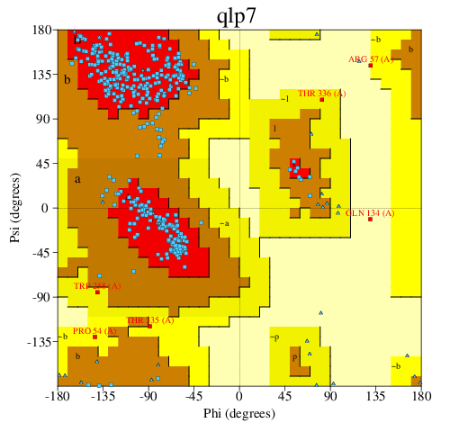

# **Tertiary Structure Prediction & Validation Report**

## **Purpose of the Tertiary Structure Analysis of Proteins**

- The purpose of homology modeling in protein structure prediction is to predict the three-dimensional (3D) structure of a protein whose experimental structure is unknown by using the known 3D structure of a related homologous protein (template). 

- The underlying principle is that protein tertiary structure is more conserved than amino acid sequence, so proteins with similar sequences tend to have similar structures. 

- This makes homology modeling a reliable and widely used computational method to generate structural models when experimental methods like X-ray crystallography or NMR are unavailable or difficult to apply.

## **Purpose of Validation of Predicted Results**

- Validation of homology models using tools like ProCheck and Verify3D serves to assess the quality and reliability of the predicted structures. 

- ProCheck evaluates stereochemical quality through parameters like Ramachandran plots showing favored and disallowed residue regions, while Verify3D assesses how compatible the 3D atomic model is with the original amino acid sequence. 

- Validation ensures that the modeled structure is geometrically reasonable and biologically meaningful, guiding further refinement for downstream applications such as function prediction, drug design, or molecular docking.

## **Methods**

## Homology Modeling

- **Tool:** Swiss-Model
- **Template Selection:** Based on sequence similarity
- **Modeling Protocol:** Involves four main steps - Identifying structural templates using BLAST or HHblits, Aligning the target sequence with the template(s), Building the 3D model through a rigid fragment assembly method and Evaluating the model's quality using the QMEAN score

## Validation

- **ProCheck:** Used to assess stereochemical quality (Ramachandran plots)
- **Verify3D:** Used to evaluate compatibility between 3D structure and sequence

## **Results**

## **Homology Model Visualizations**

Below are the RasMol visualizations of the predicted structures:

### Amyloid-Beta

### Apolipoprotein

### Beclin

### Beta-Secretase

### Tau Protein

## **Validation Statistics Table**

### **ProCheck Ramachandran Plot Statistics**
| Protein Name   | Favored Regions (%) | Allowed Regions (%) | Disallowed Regions (%) |
|----------------|---------------------|---------------------|------------------------|
| Amyloid Beta   |       84.6%         |       15.4%         |           0%           |
| Apolipoprotein |       95.6%         |       3.1%          |           1.2%         |
| Beclin         |       94.6%         |       4.7%          |           0%           |
| Beta secretase |       88.8%         |       9.8%          |           0.3%         |
| Tau protein    |       91.7%         |       8.3%          |           0%           |

### **Verify3D Scores**
| Protein Name   | % Residues with Pass Score |
|----------------|----------------------------|
| Amyloid Beta   |         100%               |
| Apolipoprotein |         83.91%             |
| Beclin         |         0%                 |
| Beta secretase |         84.84%             |
| Tau protein    |         0%                 |

## **Images of Procheck Results**

Below are the Ramachandran Plot graph visualizations of the predicted proteins structures:

### Amyloid-Beta

### Apolipoprotein

### Beclin

### Beta-Secretase

### Tau Protein

## **Discussion**

## 1. Backbone Geometry & Ramachandran Statistics

- **Apolipoprotein and Beclin models** display backbone geometry closest to the ideal, with **>94% residues in most favoured Ramachandran regions** and nearly no disallowed residues.​

- **Tau and Amyloid beta** also show good stereochemical properties, but Amyloid beta falls below the preferred 90% threshold, and Tau is marginally above it.​

- **Beta secretase** is slightly below optimal, with the lowest favoured region occupancy among the five, but overall free from major outliers.​

## 2. G-Factors

- All models present G-factor averages between **-0.25 and 0.08,** indicating small to moderate deviation from ideal geometry — **Apolipoprotein and Beclin have scores closest to zero, suggesting the least strain.​**

- **Tau and Amyloid beta models display more negative scores,** reflecting increased deviation, yet not enough to outright reject model quality.​

## 3. VERIFY3D and Fold Quality

- **Amyloid beta, Apolipoprotein, and Beta secretase pass VERIFY3D,** revealing good atomic environments and native-like folding for most residues.​

- **Beclin and Tau models fail VERIFY3D completely (0%),** suggesting global misfold or unreliable atomic environments for interpretation—these should not be used for downstream analysis until refined.

## 4. Model-Specific Perspective

**Amyloid beta:** Slightly below ideal for backbone geometry but shows perfect 3D environment compatibility, broadly dependable for structural studies.​

**Apolipoprotein:** Exceptionally strong across all validation criteria, recommended as a reference-quality model.​

**Beclin:** Structurally sound in backbone stereochemistry but fails in atomic environment compatibility demands significant remodeling or alternative templates.​

**Beta secretase:** Passes all validation checks with only moderate backbone deviations, considered as reliable with minor caution.​

**Tau:** Good backbone geometry but totally fails environmental compatibility, perhaps due to limited template coverage or inherent modeling challenge.

## **Conclusion**

- In summary, apolipoprotein, amyloid beta, and beta secretase protein models are robust, passing both backbone geometry and atomic environment validations. 

- Beclin and tau models meet core structural criteria but fail essential environmental quality checks, requiring substantial revision before reliable use. 

- This comparison underscores that successful protein modeling demands both stereochemical precision and realistic atomic environments for true research readiness.

## **Data Availability**

- All predicted 3D Model PDB files are available in the **3D_Models_PDB** directory.

- Validation plots (Ramachandran plots and Verify3D results) are stored in **Model_Validation_Results** directory.

