# **Comparative Structural & Functional Analysis of five proteins in ChimeraX**

## Objective
The objective of this final step is to perform a **detailed structural and functional comparison** between the **predicted 3D protein models** and their corresponding **experimentally resolved structures** obtained from the Protein Data Bank (PDB). This analysis aims to evaluate the **accuracy, structural integrity, and functional relevance** of the predicted models generated in earlier steps of the project.

## Input Data
- Predicted protein structures generated using **SWISS-MODEL**
- Experimentally determined protein structures retrieved from **RCSB Protein Data Bank**
- Validated models (from Ramachandran plot and Verify3D analysis)

## Software Used
- **UCSF ChimeraX (v1.11)**
- Clustal Omega (via ChimeraX web services)
- UniProt annotations integrated within ChimeraX

## Methodology

### 1. Structure Loading and Preparation
- Predicted and known protein structures were loaded into UCSF ChimeraX using the `open` command.
- Chains corresponding to homologous regions were selected for comparison.
- Secondary structure was computed for both models prior to alignment.

### 2. Sequence-Based Alignment
- Pairwise sequence alignment was performed using: `sequence align` command.
- Conserved regions were inspected to ensure correct residue correspondence before structural superposition.

### 3. Structural Superposition
- Structural alignment was performed using: `matchmaker` command.
- Backbone-based alignment with BLOSUM62 substitution matrix was applied.
- Root Mean Square Deviation (RMSD) values were calculated to quantify structural similarity.

### 4. Visualization and Analysis
- Predicted and known structures were color-coded for clear distinction.
- Structural overlap, conformational differences, and domain-level similarity were visually examined.
- Functional regions and conserved motifs were inspected using Uniprot annotations and also manually.
- H bonds are also found in the functional region.
- High-resolution images were captured using the `save` command for documentation.

## Methods Justification
- Structural similarity between predicted and experimentally resolved protein structures was assessed using UCSF ChimeraX through structure-based superposition performed with the MatchMaker tool.
- Quantitative evaluation was carried out using Root Mean Square Deviation (RMSD) values, while qualitative assessment involved visual inspection of backbone alignment and secondary structure overlap.
- Functional region conservation was evaluated by examining the spatial alignment of known functional domains and key residues annotated from UniProt and PDB records.
- Structural deviations were interpreted in the context of protein flexibility, intrinsic disorder, and experimental resolution.
- Key observations summarize whether observed differences are confined to flexible regions or have potential functional implications.

## Results
### Protein 1: *Amyloid Beta precursor protein*
**A. Structural Superposition**
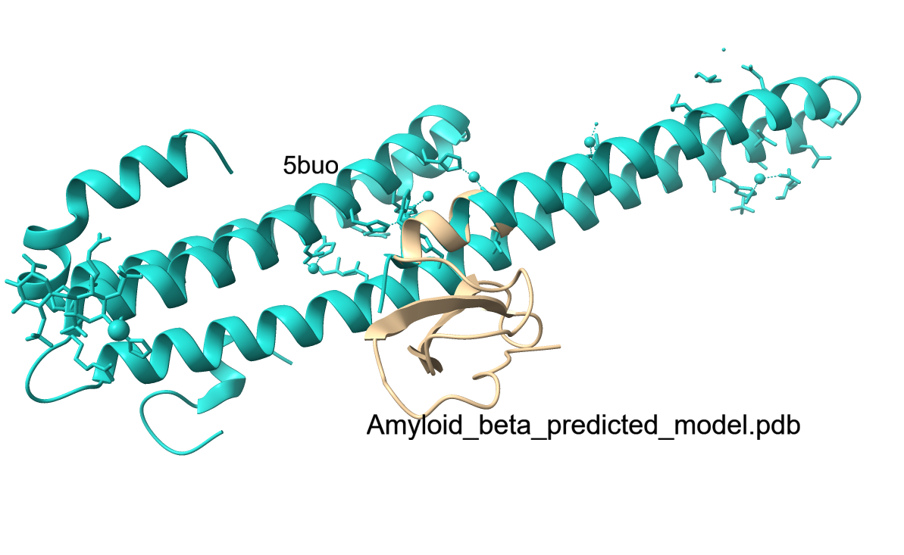

**B. Functional Region and Surface**
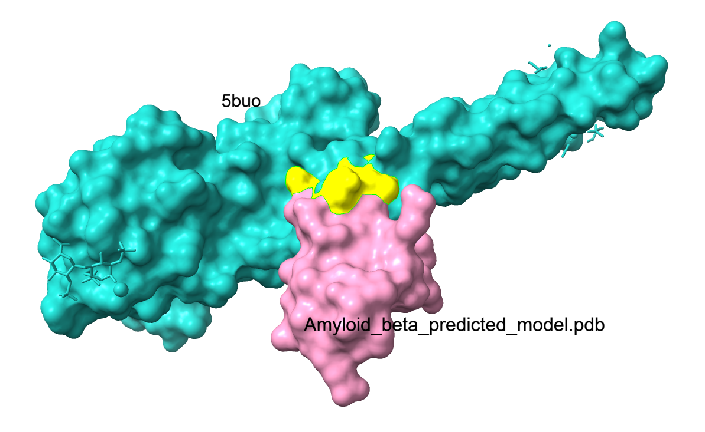

**C. Residues and Hbonds in Functional Region**

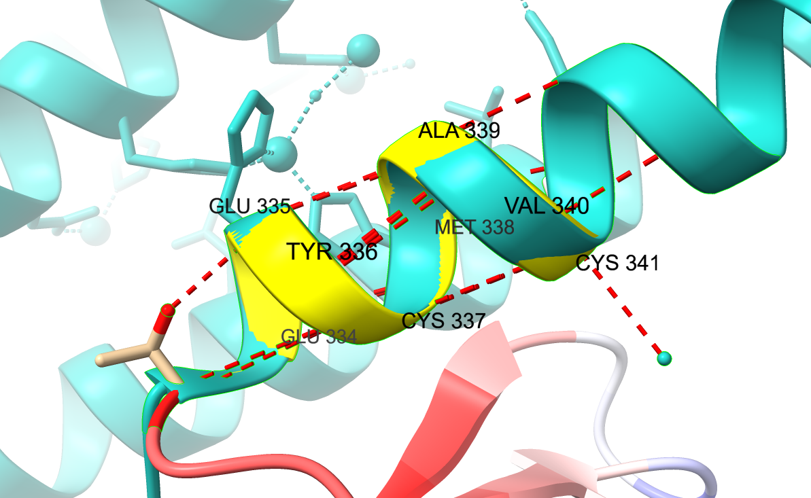

**Observation (AD Context):**
 - The predicted APP structure showed high structural similarity to the experimentally resolved structure, with a low RMSD value (0.333 Å), indicating accurate backbone alignment. Functional regions associated with amyloidogenic processing displayed strong spatial conservation, supported by the presence of ~20 stabilizing hydrogen bonds. Minor deviations were primarily observed in loop regions, which are known to be flexible and protease-accessible.

**Pathological Interpretation:**
 - The structural conservation of functional domains involved in β-secretase and γ-secretase cleavage suggests that small conformational changes in flexible regions may influence amyloid-β generation. Such subtle structural variations can modulate cleavage efficiency, contributing to amyloid plaque formation, a hallmark of Alzheimer’s disease.

### Protein 2: *Apolipoprotein*
**A. Structural Superposition**
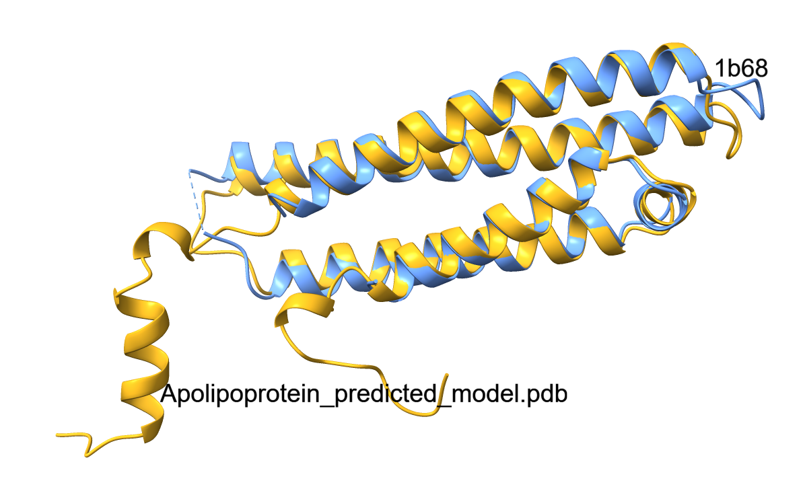

**B. Functional Region and Surface**
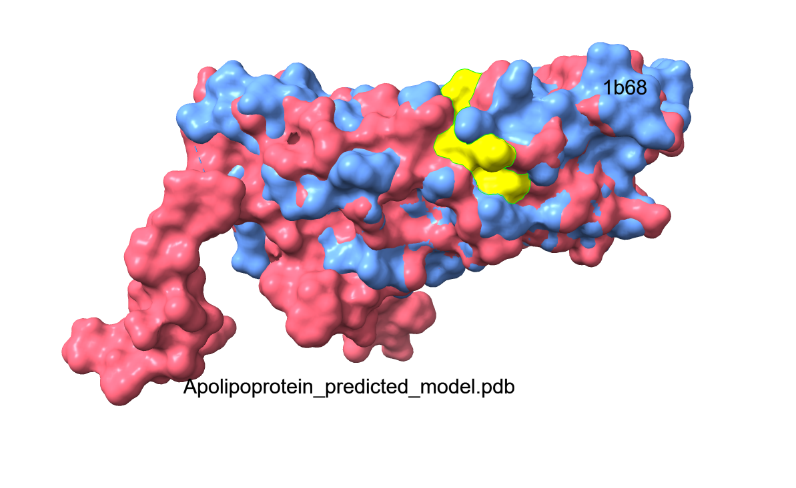

**C. Residues and Hbonds in Functional Region**

**Observation (AD Context):**
 - ApoE exhibited moderate structural divergence from the known structure, with an RMSD of 0.773 Å. Despite this, functional regions involved in lipid binding and receptor interaction remained structurally conserved. Approximately 20 hydrogen bonds stabilized the functional interface, while deviations were mainly confined to surface-exposed regions.

**Pathological Interpretation:**
 - Structural variability in surface regions may influence lipid transport efficiency and amyloid-β clearance, particularly relevant for ApoE’s isoform-dependent behavior. These conformational differences help explain why ApoE is a major genetic risk factor for AD, especially in impaired amyloid clearance pathways.

### Protein 3: *BACE1 (β-Secretase)*
**A. Structural Superposition**
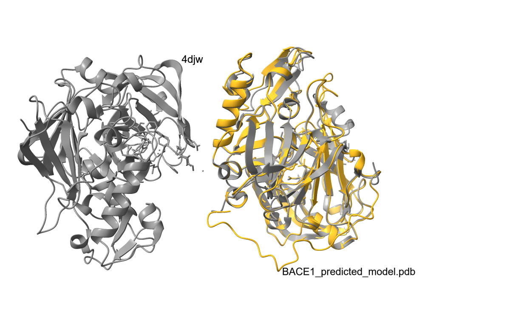

**B. Functional Region and Surface**
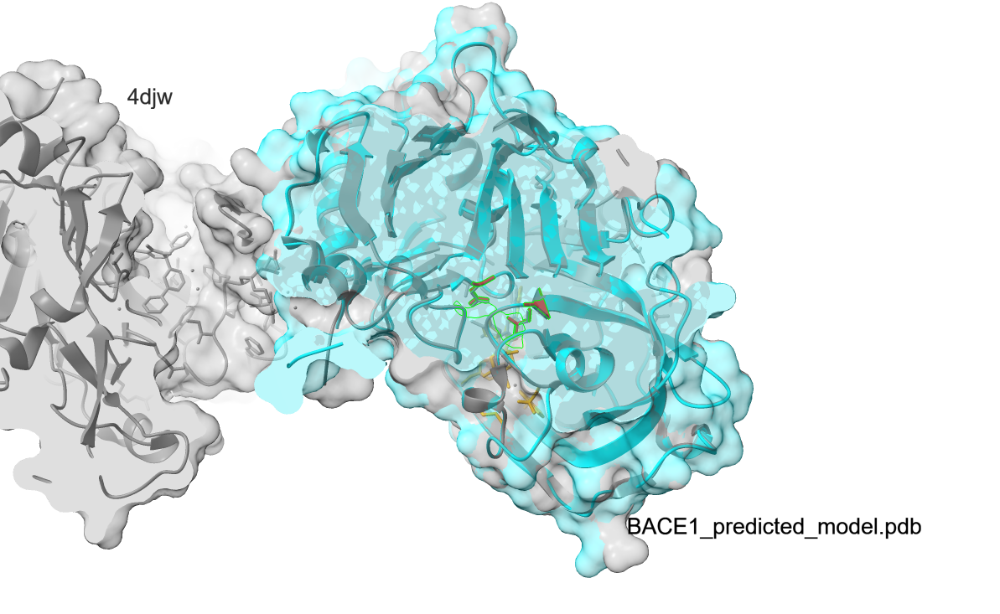

**C. Residues and Hbonds in Functional Region**

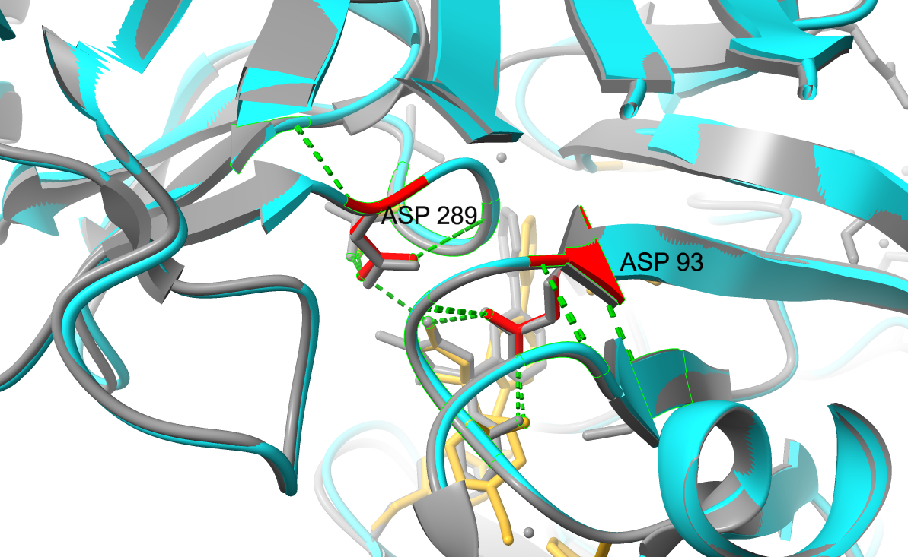

**Observation (AD Context):**
 - The predicted BACE1 structure aligned well with the experimentally resolved structure, showing conserved catalytic and active site residues. Functional region mapping revealed minimal deviation in the enzymatic core, while peripheral loops exhibited limited flexibility. Hydrogen bond interactions maintained active site integrity.

**Pathological Interpretation:**
 - Structural conservation of the catalytic domain reinforces BACE1’s stable enzymatic role in amyloidogenic APP processing. Preservation of active-site geometry explains its efficiency in generating amyloid-β peptides, making BACE1 a key therapeutic target in Alzheimer’s disease.

### Protein 4: *Beclin-1*
**A. Structural Superposition**
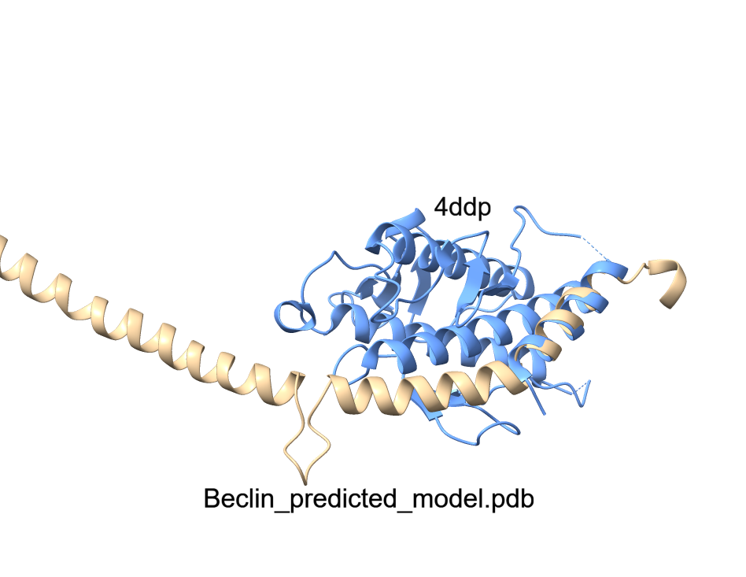

**B. Functional Region and Surface**
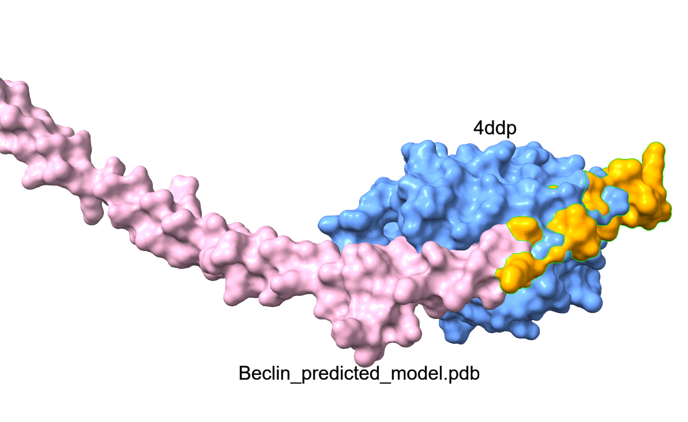

**C. Residues and Hbonds in Functional Region**

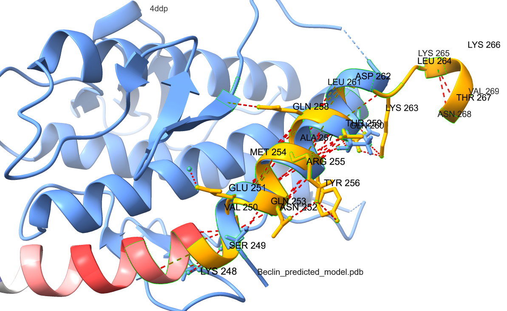

**Observation (AD Context):**
 - The predicted Beclin-1 structure demonstrated good alignment with its known structure, with conservation of domains involved in autophagy regulation. Key residues formed stabilizing hydrogen bond networks, while flexible regions were observed at terminal ends.

**Pathological Interpretation:**
 - Preservation of autophagy-related structural motifs supports Beclin-1’s role in cellular clearance mechanisms. Structural destabilization or reduced expression of Beclin-1 may impair autophagy, leading to accumulation of toxic protein aggregates, thereby accelerating neurodegeneration in Alzheimer’s disease.

### Protein 5: *Tau Protein*
**A. Structural Superposition**
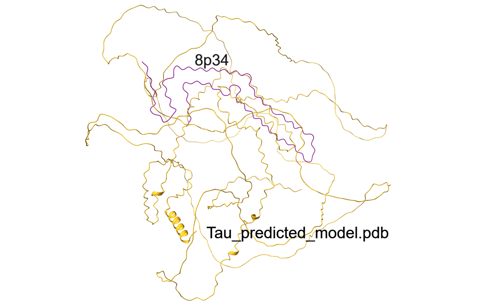

**B. Functional Region and Surface**
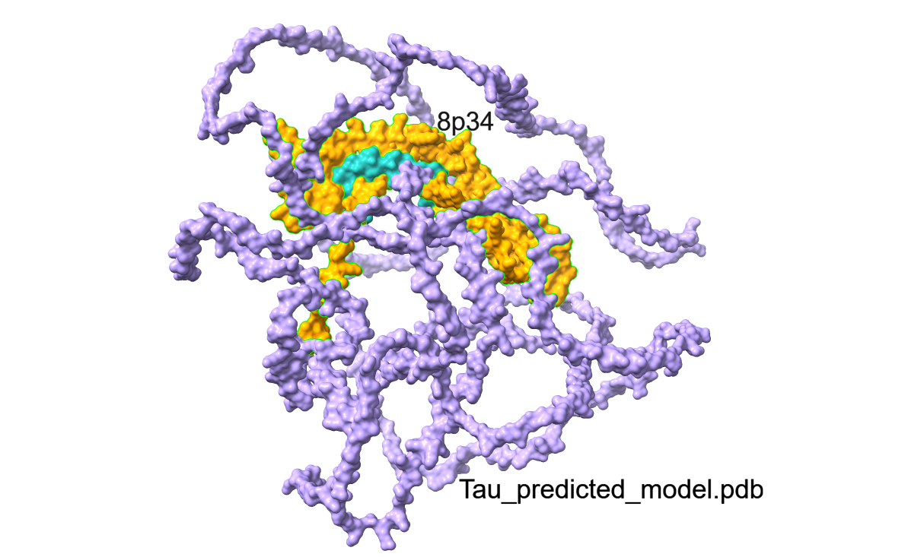

**C. Residues and Hbonds in Functional Region**

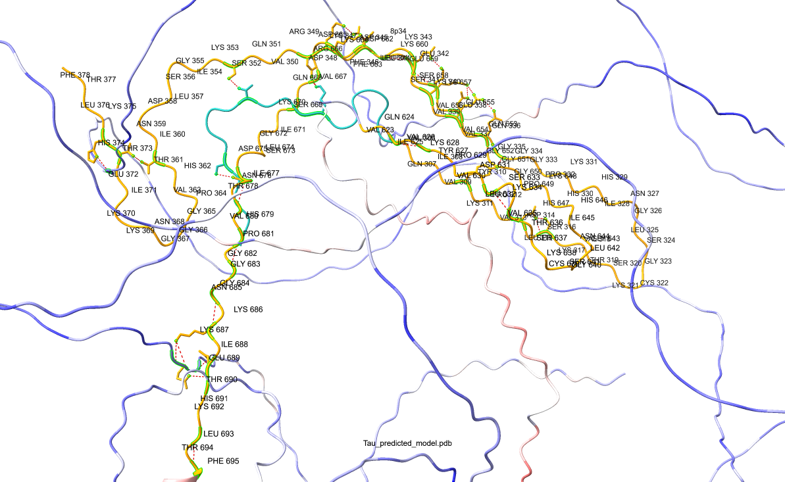

**Observation (AD Context):**
 - Structural superposition revealed moderate deviations localized to intrinsically disordered regions, while core regions showed reasonable alignment with known structures. Functional residues involved in microtubule binding were spatially clustered, and multiple hydrogen bonds were observed stabilizing these regions. The predicted structure highlighted high flexibility in repeat domains, consistent with tau’s known conformational plasticity.

**Pathological Interpretation:**
 - The observed structural flexibility supports tau’s propensity for misfolding and aggregation. Destabilization in repeat regions may facilitate hyperphosphorylation and neurofibrillary tangle formation, directly contributing to neuronal dysfunction and disease progression in AD.

## Conclusion
The structural and functional comparison using UCSF ChimeraX demonstrates that the predicted protein models generated in this project are **structurally accurate and functionally meaningful**. This analysis provides confidence in downstream applications such as **functional annotation, drug target analysis, and protein interaction studies**.

## Reproducibility
- ChimeraX session logs and alignment outputs are preserved in the `ChimeraX/` directory.
- Image files are stored in the `ChimeraX/` directory with protein-wise organization.
- All steps can be reproduced using the documented ChimeraX commands.

  
